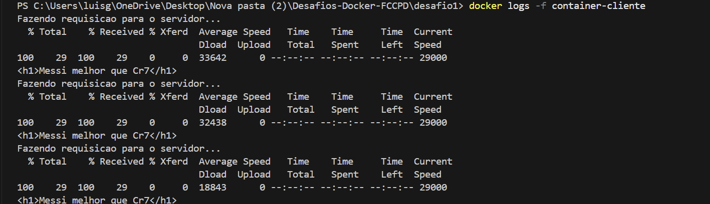

# Desafio 1: Containers em Rede

## Descrição da Solução
Este projeto foi desenvolvido para demonstrar a comunicação entre dois containers Docker isolados, utilizando uma rede **Bridge** customizada. O objetivo é simular uma arquitetura Cliente-Servidor simples, onde um container consome dados de outro periodicamente.

##  Arquitetura e Decisões Técnicas

A solução é composta por três componentes principais:

1.  **Rede Docker (`rede-desafio1`)**:
    * Foi criada uma rede do tipo *bridge* para permitir o isolamento dos containers.
    * **Por que?:** Redes customizadas permitem a resolução de DNS automática. Isso significa que o container `cliente` consegue encontrar o container `servidor` apenas pelo nome, sem precisar saber o endereço IP.

2.  **Serviço Servidor (`/servidor`)**:
    * **Base:** Imagem `nginx:alpine` (escolhida por ser leve).
    * **Configuração:** O arquivo de configuração padrão do Nginx foi modificado via `sed` no Dockerfile para escutar na porta **8080**, atendendo aos requisitos do desafio.
    * **Conteúdo:** Serve um arquivo HTML estático personalizado.

3.  **Serviço Cliente (`/cliente`)**:
    * **Base:** Imagem `alpine:latest`.
    * **Lógica:** Executa um script Shell (`loop.sh`) que faz um loop infinito.
    * **Ação:** A cada 5 segundos, envia uma requisição HTTP (`curl`) para `http://container-servidor:8080` e imprime a resposta no terminal.

## Estrutura de Arquivos

```text
desafio1/
├── cliente/
│   ├── Dockerfile       # Definição da imagem do cliente
│   └── loop.sh          # Script de requisição em loop
├── servidor/
│   ├── Dockerfile       # Definição da imagem do servidor (Nginx)
│   └── Mensagem.html    # Página HTML da mensagem
└── README.md            # Documentação do desafio
 Instruções de Execução
Siga os passos abaixo para executar o projeto.

1. Criar a Rede
Cria a rede bridge para conectar os containers.

docker network create rede-desafio1

2. Executar o Servidor
Navegue até a pasta servidor, construa a imagem e inicie o container.

cd desafio1

cd servidor

docker build -t imagem-servidor .

docker run -d --name container-servidor --network rede-desafio1 imagem-servidor

cd ..

3. Executar o Cliente
Navegue até a pasta cliente, construa a imagem e inicie o container.

cd cliente

docker build -t imagem-cliente .

docker run -d --name container-cliente --network rede-desafio1 imagem-cliente

cd ..

4. Validar o Funcionamento (Logs)
Para verificar a troca de mensagens, acesse os logs do container cliente:

docker logs -f container-cliente

Saída esperada no terminal:

Fazendo requisicao para o servidor...
<h1>Messi melhor que Cr7</h1>

Fazendo requisicao para o servidor...
<h1>Messi melhor que Cr7</h1>

Parar e Limpar
Para encerrar os testes e remover os containers:

docker rm -f container-servidor container-cliente

```
## Saida esperada


