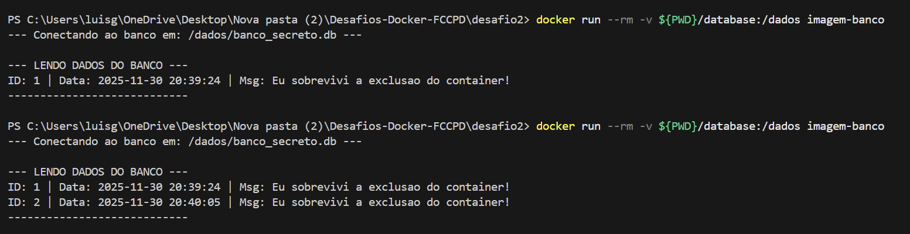

# Desafio 2: Volumes e Persistência

## Sobre o Projeto
O objetivo deste desafio foi garantir que dados sensíveis não fossem perdidos quando um container fosse desligado ou removido. Para isso, criei uma aplicação em Python que utiliza um banco de dados SQLite e configurei um **Volume Docker** para salvar os arquivos no meu computador (host), e não apenas dentro do container.

## Como funciona (Arquitetura)

1.  **Aplicação (`app_banco.py`)**:
    * É um script Python simples que conecta a um banco SQLite.
    * Toda vez que roda, ele insere um registro novo com a data/hora atual e lista tudo o que está salvo no banco.
    * O banco é salvo no caminho `/dados/banco_secreto.db`.

2.  **O Volume (Bind Mount)**:
    * No Dockerfile, preparei a pasta `/dados`.
    * Na hora de rodar (`docker run`), usei a flag `-v` para ligar uma pasta do meu computador à pasta `/dados` do container.
    * **Resultado:** O arquivo `.db` é gravado fisicamente no meu HD. Se eu apagar o container, o arquivo continua lá.

## Estrutura de Arquivos

```text
desafio2/
├── database/            # Pasta criada automaticamente (onde fica o .db)
├── app_banco.py         # Script Python do banco de dados
├── Dockerfile           # Configuração da imagem Python
└── README.md            # Documentação]
└──Print_Solucao.png     # Imagem da solução
Passo a Passo para Testar

Siga os comandos abaixo no terminal, dentro da pasta desafio2.

1. Construir a Imagem

docker build -t imagem-banco .

2. Primeira Execução (Criando o Banco)
Rode o container mapeando o volume. O comando --rm garante que o container seja deletado assim que terminar, provando que ele não guarda nada na "memória interna".

docker run --rm -v ${PWD}/database:/dados imagem-banco

Nota: Se estiver usando Git Bash ou Linux, troque ${PWD} por $(pwd).

Saída esperada (1º Log): Vai aparecer apenas 1 registro (o ID 1).

3. Segunda Execução (Provando a Persistência)
Rode exatamente o mesmo comando novamente.

docker run --rm -v ${PWD}/database:/dados imagem-banco

Saída esperada (2º Log): Agora devem aparecer 2 registros. O script leu o banco que foi criado na execução anterior, provando que os dados persistiram fora do container.


--- LENDO DADOS DO BANCO ---
ID: 1 | Data: 2024-11-30 10:00:00 | Msg: Eu sobrevivi a exclusao do container!
ID: 2 | Data: 2024-11-30 10:00:05 | Msg: Eu sobrevivi a exclusao do container!

```
## Saida esperada

