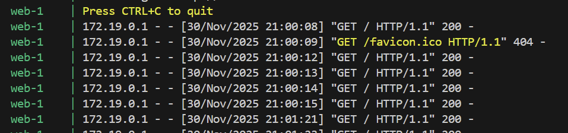
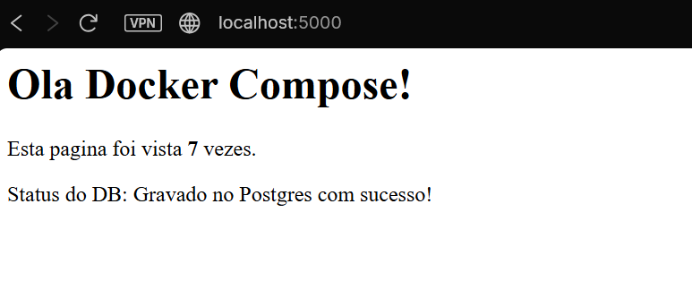

# Desafio 3: Docker Compose Orquestrando Serviços

## Sobre o Projeto
Neste desafio, utilizei o **Docker Compose** para orquestrar uma aplicação completa composta por três serviços interligados. [cite_start]O objetivo foi demonstrar como gerenciar múltiplas dependências e redes internas sem precisar subir cada container manualmente[cite: 46, 47].

##  Arquitetura da Solução

[cite_start]O sistema foi dividido em três camadas (Microsserviços)[cite: 49]:

1.  **Aplicação Web (`web`)**:
    * **Tecnologia:** Python com Flask.
    * **Função:** É o frontend que o usuário acessa. Ele recebe a requisição, incrementa um contador no Cache e salva um registro de log no Banco de Dados.
    * [cite_start]**Configuração:** As senhas e endereços dos bancos foram passados via variáveis de ambiente (`environment`) no arquivo `docker-compose.yml`, garantindo segurança e flexibilidade[cite: 50].

2.  **Cache (`redis`)**:
    * **Tecnologia:** Redis Alpine.
    * **Função:** Armazena o contador de visitas de forma rápida em memória.

3.  **Banco de Dados (`db`)**:
    * **Tecnologia:** PostgreSQL.
    * **Função:** Guarda o histórico persistente de acessos.

### Detalhes Técnicos
* [cite_start]**Rede Interna:** Criei uma rede chamada `minha-rede` para que os containers conversem entre si usando seus nomes de serviço (`web`, `redis`, `db`)[cite: 52].
* [cite_start]**Ordem de Inicialização:** Usei a diretiva `depends_on` para garantir que a aplicação web saiba que depende do banco e do cache para rodar[cite: 52].

## 📂 Estrutura de Arquivos

```text
desafio3/
├── app/
│   ├── app.py           # Código da aplicação Flask
│   ├── Dockerfile       # Definição da imagem Web
│   └── requirements.txt # Dependências (Flask, Redis, Psycopg2)
├── docker-compose.yml   # Maestro que sobe todos os serviços
└── README.md            # Documentação
└── print_terminal.png   # Imagem do terminal pegando log do banco de dados
└── Site_funcionando.png # Imagem de que o site funcionou

Como Executar
Diferente dos desafios anteriores, aqui usamos apenas um comando para subir todo o ambiente.

1. Subir a Aplicação
Na pasta desafio3, execute:

docker-compose up --build

O parâmetro --build garante que qualquer alteração no código Python seja recompilada antes de subir.

2. Validar o Funcionamento
Acesse no seu navegador: http://localhost:5000.

Atualize a página (F5) algumas vezes.

Você verá o contador aumentando ("Esta pagina foi vista X vezes").

No terminal, você verá os logs confirmando que o dado foi salvo no Postgres.

Imagens abaixo desse arquivo

Parar e Limpar
Para derrubar todos os serviços e limpar a rede criada:

docker-compose down

```
Evidência de Funcionamento:
## Terminal

## Site


