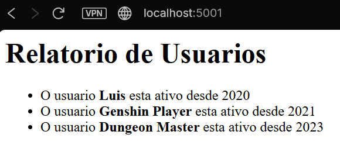

# Desafio 4: Microsserviços Independentes

## Sobre o Projeto
Este desafio implementa uma arquitetura de microsserviços simples, onde a responsabilidade de **armazenar dados** é separada da responsabilidade de **exibir dados**. O objetivo é demonstrar a comunicação HTTP síncrona entre dois containers independentes rodando na mesma rede Docker.

## Arquitetura da Solução

O sistema é composto por dois serviços distintos que se comunicam via API REST:

1.  **Serviço A (API de Dados - Backend)**:
    * **Função:** Atua como o "banco de dados" ou provedor de informações.
    * **Endpoint:** Exponibiliza a rota `/users` na porta interna **5000**.
    * **Retorno:** Entrega uma lista de usuários em formato JSON cru.

2.  **Serviço B (Frontend Consumidor)**:
    * **Função:** Atua como a interface para o usuário final.
    * **Lógica:** Ao receber um acesso, ele faz uma requisição HTTP (`GET`) para o Serviço A, processa o JSON recebido e renderiza uma página HTML formatada.
    * **Comunicação:** Acessa o Serviço A pelo nome de host `servico-a` (resolução de DNS interna do Docker).

## Estrutura de Arquivos

```text
desafio4/
├── servico_a/
│   ├── app.py           # API que fornece o JSON
│   └── Dockerfile       # Imagem Python simples
├── servico_b/
│   ├── app.py           # App que consome a API e gera HTML
│   └── Dockerfile       # Imagem Python com biblioteca 'requests'
└── README.md            # Documentação
└── Site_Mostrando_Resultado.png # Imagem do site funcionando

 Como Executar
Siga os passos abaixo para subir os serviços manualmente e testar a integração.

1. Criar a Rede
É necessário uma rede bridge para que os serviços se encontrem pelo nome.

docker network create rede-micros

2. Subir o Serviço A (API)
Este serviço roda em segundo plano e não precisa expor porta para o host (apenas para a rede interna).

cd servico_a
docker build -t imagem-a .
docker run -d --name servico-a --network rede-micros imagem-a
cd ..

3. Subir o Serviço B (Frontend)
Este serviço expõe a porta 5001 para que possamos acessar pelo navegador.

cd servico_b
docker build -t imagem-b .
docker run -d --name servico-b --network rede-micros -p 5001:5001 imagem-b
cd ..

4. Validar o Funcionamento
Abra o navegador em: http://localhost:5001

Você deve ver um relatório HTML formatado (bullet points).

Isso comprova que o Serviço B conseguiu buscar os dados no Serviço A.

Evidência de Funcionamento esta mais abaixo no readme

Parar e Limpar
Para remover os containers e a rede:

docker rm -f servico-a servico-b
docker network rm rede-micros

```
## Saida esperada

