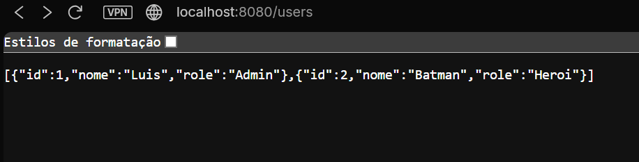
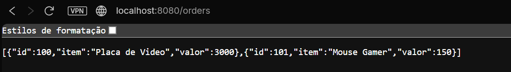

# Desafio 5: Microsserviços com API Gateway

## Sobre o Projeto
Este desafio final implementa uma arquitetura de microsserviços utilizando o padrão **API Gateway**. O objetivo foi centralizar a entrada de requisições em um único ponto (Nginx), que redireciona o tráfego para os serviços adequados (Usuários ou Pedidos) sem que o cliente precise saber onde eles estão rodando.

## Arquitetura da Solução

A solução utiliza 3 containers orquestrados via Docker Compose:

1.  **API Gateway (`nginx`)**:
    * **Porta Exposta:** 8080.
    * **Função:** Atua como "Reverse Proxy". Ele recebe todas as chamadas externas.
    * **Regras de Roteamento:**
        * Se o usuário acessa `/users` -> Redireciona para o container `service-users`.
        * Se o usuário acessa `/orders` -> Redireciona para o container `service-orders`.

2.  **Microsserviço de Usuários (`users`)**:
    * **Tecnologia:** Python Flask.
    * **Rede:** Totalmente isolado na rede interna (não acessível diretamente pelo host).
    * **Retorno:** JSON com lista de usuários.

3.  **Microsserviço de Pedidos (`orders`)**:
    * **Tecnologia:** Python Flask.
    * **Rede:** Isolado na rede interna.
    * **Retorno:** JSON com lista de pedidos.

### Benefício da Arquitetura
Esta abordagem aumenta a segurança, pois expõe apenas uma porta (8080) e permite que a lógica de roteamento seja alterada sem mudar o código dos serviços.

## Estrutura de Arquivos

```text
desafio5/
├── users/               # Microsserviço 1
│   ├── app.py
│   └── Dockerfile
├── orders/              # Microsserviço 2
│   ├── app.py
│   └── Dockerfile
├── nginx.conf           # Configuração de rotas do Gateway
├── docker-compose.yml   # Orquestração de todo o ambiente
└── README.md            # Documentação
└── print_orders.png     # Imagem de orders funcionando
└── print_users.png      # Imagem de users funcionando
Como Executar
Utilize o Docker Compose para subir a arquitetura completa com um comando.

1. Iniciar o Ambiente
Na pasta desafio5, execute:

docker-compose up --build

2. Validar o Funcionamento (Rotas)
Agora você tem um ponto único de acesso: localhost:8080.

Teste 1 (Usuários): Acesse http://localhost:8080/users

Resultado Esperado: JSON com dados dos usuários (ex: Luis, Batman).

Teste 2 (Pedidos): Acesse http://localhost:8080/orders

Resultado Esperado: JSON com dados de produtos (ex: Placa de Video).

Evidência de Funcionamento estara mais abaixo do readme

Parar e Limpar
Para derrubar o gateway e os microsserviços:

docker-compose down

```
## Saida esperada
## Users

## Orders

